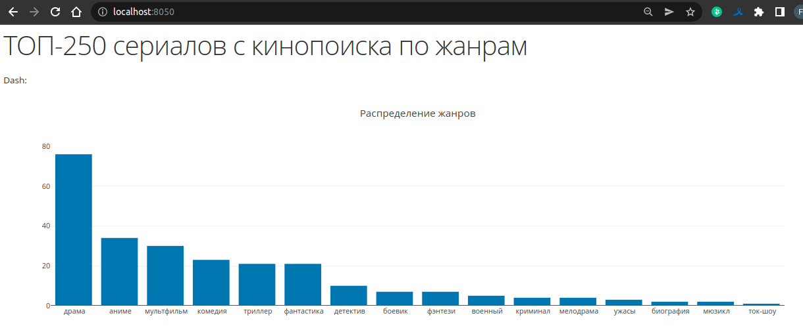
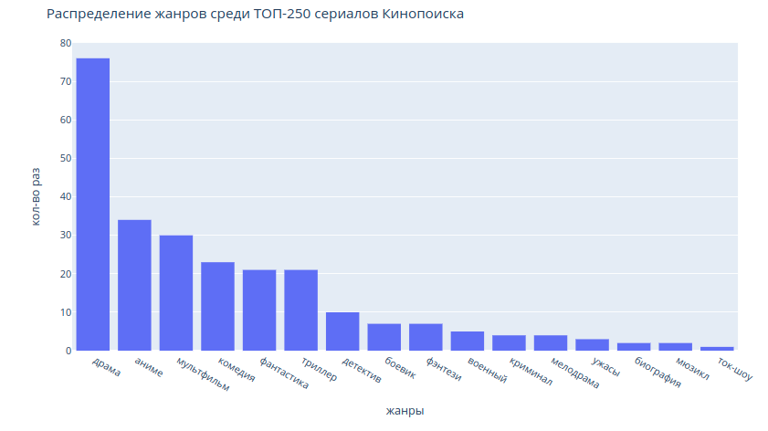

# Кинопоиск ТОП-250 сериалов гистограмма

Написана программа на python которая будет парсить список
сериалов https://www.kinopoisk.ru/lists/series-top250/ и выдавать необходимый анализ.

Доступ к гистрограмме предоставлен 2 способами. Jupyter-notebook ``histogram_genre.ipynb`` 
и посредством запуска контейнера, в котором висит web сервис на проту http://127.0.0.1:8050/


## Загрузка

- **clone repository**

    ```shell
    git clone https://github.com/vavasya/Pet_projects.git
    cd Pet_projects
    ```
- **prepare config file**

  copy template config:

    ```shell
    cp ./config/config_template.ini ./config/config.ini
    ```

  fill template config:

    ```shell
    vim ./configs/config.ini
    ```

- **build & run**

    ```shell
    docker build -t top_250 .
    docker run -d -p 8050:8050 --rm  --network='host' -v "$PWD/config.ini:/usr/project/config.ini" -v "$PWD/data/:/usr/project/data/" --name top_250_run top_250
    ```

  ##  Парсинг Кинопоиска (ТОП-250 сериалов)
  В репозитории уже лежат дампы с собраными данными. Для успешного парсинга необходим API  ключ от прокси zyte. Так же можно легко адапатировать код под другой прокси.

    ```shell
    rm data/*
    docker exec -it top_250_run bash
    python main.py
    exit
    ```

    reading logs:
    ```shell
    docker logs -f top_250_run
    ```

    stopping:
    ```shell
    docker stop top_250_run
    ```
  
## Результат парсинга web сервис на проту 8050


## Результат в Jupyter (plotly)
